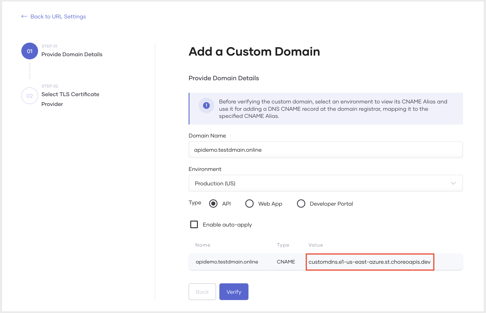
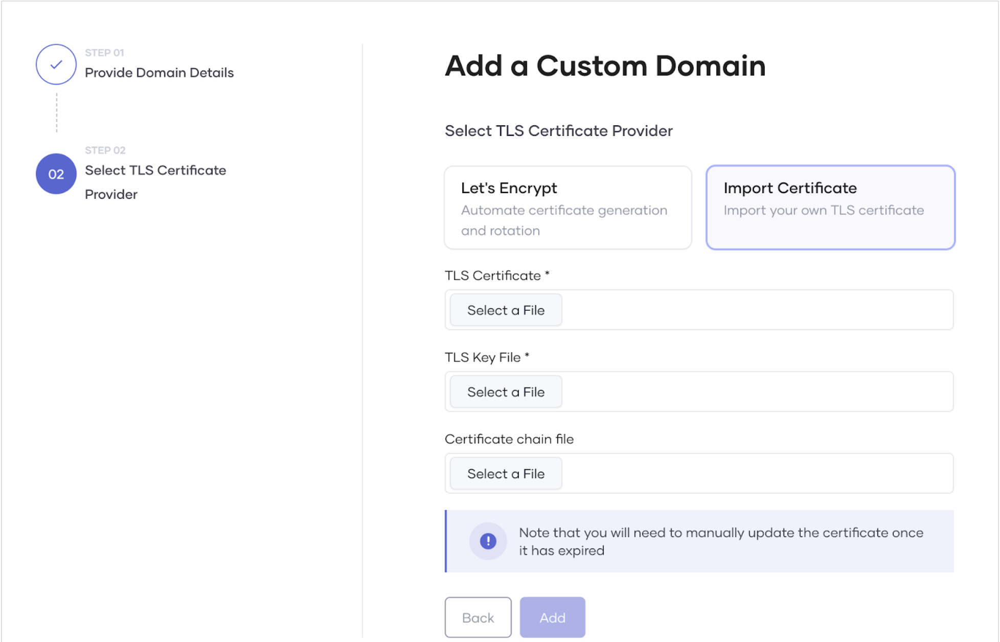
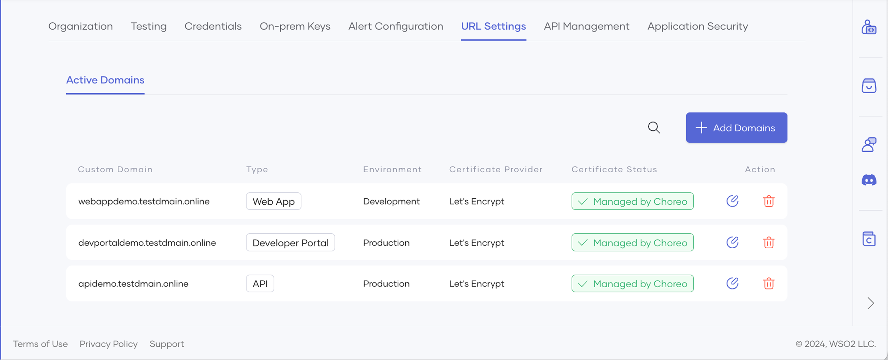
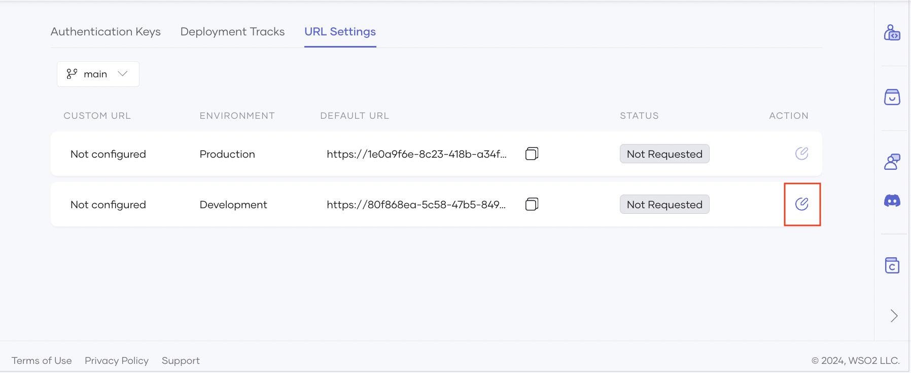
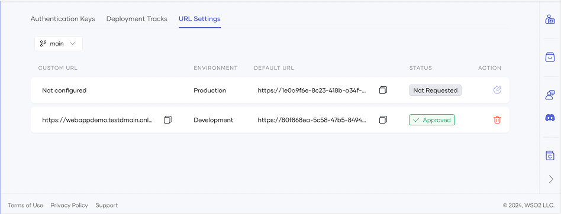

# Configure a Custom Domain for Your Organization

A custom domain is essential for effective branding, discoverability, and credibility of an integration as API. Devant allows you to easily configure custom domains for your organization, enabling developers to utilize it to configure custom URLs for their integrations as APIs.

!!! info "Note"
    The Custom Domains feature is provided exclusively to paid subscribers. Free-tier organizations do not have access to custom domain configuration.

This section provides an overview of Devant’s custom domain configuration model and guides you through configuring a custom domain for your organization. It also walks you through utilizing a custom domain to configure a custom URL for an integration.

## Devant custom domain configuration model

Devant allows organization administrators to add custom domains for their organizations. When an administrator adds custom domains to an organization, developers can utilize the custom domains for their respective integrations. 

## Configure a custom domain for an organization

### Prerequisites

1. Sign in to the [Devant Console](https://console.devant.dev/).
2. Create an organization in Devant.

### Add a custom domain

To add a custom domain for your organization, follow the steps given below:

!!! info "Note"
     To add a custom domain, you must have organization administrator privileges.

1. Sign in to the [Devant Console](https://console.devant.dev/).
2. In the Devant Console header, click the **Organization** list.
3. In the left navigation menu, click **Admin**, then select **Settings** to open the organization-level settings page.
4. Click the **URL Settings** tab and then click the **Active Domains** tab.
5. Click **+ Add Domains**. 
6. In the **Add a Custom Domain** pane, do the following:
    1. Enter your domain name.
    2. Select the environment to apply the domain name.
    3. Select the entity type to apply the domain name.

        !!! tip
             In this context:

              - The **API** entity type represents integrations as APIs.

    4. (Optional) Select the **Enable auto-apply** checkbox to automatically apply this domain to all APIs in the selected environment.

        !!! info
            This option is only available when the entity type is set to **API**.
            If this option is enabled, you do not need to manually configure a custom URL for each API.
            The custom domain will be automatically applied to all **existing** and **new** APIs in the selected environment.
            Only the domain is applied automatically; the original context of each API remains unchanged.

 7. Take a look at the generated CNAME target value displayed and create a DNS record associating the domain name to the CNAME target value with your DNS provider.
    
    

    !!! info
          When you select **Developer Portal** as the type, the environment is not applicable, and the CNAME alias will be displayed as follows:
           

 8. Once the CNAME type DNS record is created, click **Verify**.

    !!! info "Note"
          If the CNAME mapping is correct, the verification completes successfully. It can take some time for the configured CNAME mapping to be globally available.

 9. On successful verification of the custom domain, click **Next**.
 10. Select a TLS certificate provider depending on your preference. You can either import the TLS certificates you created for the custom domain or click **Let's Encrypt** to allow Devant to generate and manage the certificates for you.

    !!! note "If you want to import your own certificate, it should adhere to specific guidelines"
          - TLS certificate guidelines:
             - It should be issued by a certificate authority (CA) and should contain the domain's public key along with additional information such as the domain name, the company that owns the domain, the certificate's expiration date, and the digital signature of the issuing CA.
             - It should be an X509 certificate.
             - It should be in the PEM format.
             - It should be issued directly or through a wildcard entry for the provided custom URL. For example,
                - For direct issuance, the SSL file must include the exact domain name. For example, if the domain is `apis.choreo.dev`, the SSL file must include `apis.choreo.com`.
                - For wildcard entries, the SSL file should use a wildcard notation to cover all subdomains under the provided URL. For example, if the CNAME is `apis.choreo.dev`, the SSL file should use `*.choreo.dev`.
          - TLS key file guidelines:
             - It should be in the PEM format.
             - It must be encrypted using RSA encryption.
          - Certificate chain file guidelines:
             - The chain file, which is essential for some clients to verify the authenticity of a server's SSL/TLS certificate, should contain your domain's SSL/TLS certificate (optional, as this can be provided via the certificate itself) and one or more intermediate certificates in the correct order, leading back to a root certificate. 
             - All certificates in the chain should be X509 certificates in PEM format.
               <details><summary>For step-by-step instructions on constructing a certificate chain with a root certificate, click here</summary>
               To construct a certificate chain with a root certificate, you must organize and combine the certificates in the correct sequence. A typical certificate chain consists of the following:
                 - **Root certificate**: The trusted self-signed certificate issued by the certificate authority (CA).
                 - **Intermediate certificates** (if any): Certificates issued by the root CA to subordinate CAs.
                 - **Leaf certificate**: Your end-entity certificate issued by the CA. This is an optional certificate that may be included within the chain or provided separately.<br><br>
                Follow these steps to construct the certificate chain:
                    1. Obtain and organize your certificates in the correct order:
                        - **Leaf certificate**: The public certificate issued by the CA. This is optional and may be included within the chain or provided separately.
                        - **Intermediate certificates**: Obtain these from the CA, if applicable.
                        - **Root certificate**: Obtain this from the CA.  If it is self-signed, it serves as the trust anchor.
                    2. Combine the certificates into a single file in the following order:
                        - Leaf certificate: This is your public certificate issued by the CA.
                        - Intermediate certificates if applicable: Include these in the correct hierarchical order.
                        - Root certificate: Include this at the end of the file.<br><br>
                        Use a text editor or a command-line tool to concatenate the certificates into one file, ensuring each certificate begins and ends with the proper markers. Also make sure the `BEGIN CERTIFICATE` and `END CERTIFICATE` markers appear on a new line:
                    ```
                     -----BEGIN CERTIFICATE-----
                     <Leaf Certificate Content>
                     -----END CERTIFICATE-----
                     -----BEGIN CERTIFICATE-----
                     <Intermediate Certificate Content>
                     -----END CERTIFICATE-----
                     -----BEGIN CERTIFICATE-----
                     <Root Certificate Content>
                     -----END CERTIFICATE-----
                    ```
                    3. Save the concatenated file. You can save it with a name such as `certificate_chain.pem`.
                    4. Use the following command to verify that your certificate chain is constructed correctly:
                    ```
                    openssl verify -CAfile <root_or_bundle_cert>.pem certificate_chain.pem
                    ```
                    Replace `<root_or_bundle_cert>.pem` with the path to your root certificate or a bundle containing both the root and intermediate certificates.
                    5. Once the certificate chain is verified, upload it via the Devant Console:
                        
                        - If the constructed chain includes the leaf certificate, follow these steps:
                            - Upload the constructed certificate chain in the **TLS Certificate** field.
                            - Upload the private key file in the **TLS Key File** field.
                            - Do not upload a certificate chain file, as it is already included in the TLS certificate.
                        - If the constructed chain does not include the leaf certificate, follow these steps:
                            - Upload the leaf certificate in the **TLS Certificate** field.
                            - Upload the private key file in the **TLS Key File** field.
                            - Upload the constructed certificate chain in the **Certificate Chain File** field.
 
     To proceed with this step in this guide, click **Let's Encrypt**.

 11. To save the custom domain, click **Add**.
 
Now, you have successfully added a custom domain for your organization.

You can see the added custom domain listed in the **Active Domains** tab under the URL **Settings** tab.
    
 

The custom domain you added will be available to the entity types in the specified environment. You can use the custom domain when configuring a custom URL for an integration.

!!! info "Note"
     If you add a custom domain for the **Developer Portal** type, the customization is applied immediately, and you can access the organization’s Developer Portal via the added domain.

If you want to view the entity types that use a particular custom domain, click the specific custom domain listed in the **Active Domains** tab under **URL Settings**.
 
## Configure a custom URL for an integration

When an organization administrator adds custom domains for specific environments, developers can use any available custom domain to configure a custom URL for an integration in a specific environment.

### Add a custom URL to an integration

To add a custom URL for your integration, follow the steps given below:

!!! info "Note"
     Before you add a custom domain for a specific environment, ensure that the integration is deployed to that environment.

1. Sign in to the [Devant Console](https://console.devant.dev/).
2. In the **Integration Listing** pane, click on the integration for which you want to customize the URL.
3. In the left navigation menu, click **Admin** and then **Settings**. This opens the integration-level settings page.
4. Click the **URL Settings** tab. This displays the active deployments of the integration across different environments and indicates whether a custom URL is configured. If an active custom domain is available to configure a custom URL for a integration in a specific environment, the **Edit URL Mapping** icon in the corresponding **Action** column becomes enabled.
    
    

5. To configure a custom URL for a integration in a specific environment, click the **Edit URL Mapping** icon under the **Action** column corresponding to the respective environment. This opens the **URL Settings** dialog, where you can specify values to add to a custom URL.

6. In the **URL Settings** dialog, select a domain to configure a custom URL.

    !!! tip
          - The **Domain** drop-down lists the available domains for the integration. You can  add any listed domain.
          - If you want to add a custom URL for an API, you must specify an appropriate context path in the **Path** field. The **Path** field displays the default context path for the API. You can edit the path depending on your preference. 

7. Click **Deploy**. This creates the custom URL mapping, which you can see under the **URL Settings** tab.  The custom URL will be in the **Approved** state.
    
    

!!! info "Note"
     By default, any user with the `Manage URL Mappings` permission can deploy custom URL mappings. For better governance, you can configure an approval process for URL mappings using [Devant Workflows](./configure-approvals-for-devant-workflows.md).

   Once deployed, both the custom URL and the default URL can be used to access the integration. 
    
   Now you have successfully utilized the configured custom domain to set up a custom URL for an integration.
