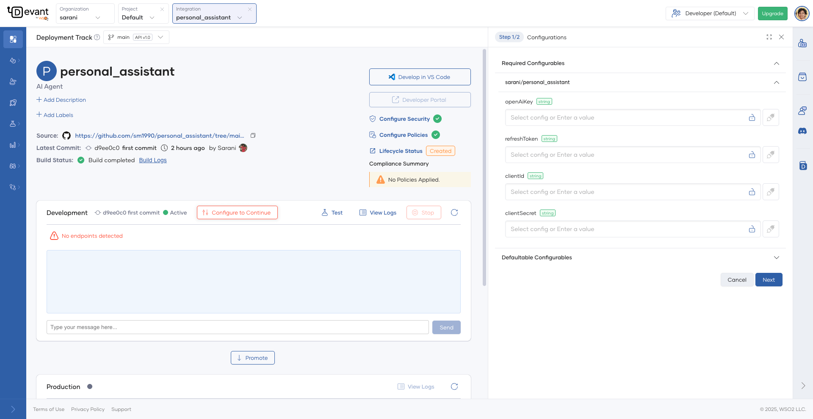

# Deploy an AI Agent Created Using WSO2 Integrator: BI

This guide walks you through deploying an AI Agent created using WSO2 Integrator: BI to Devant, using the **Deploy to Devant** option available in its UI.

!!! note
        This guide assumes you have already created an AI Agent by following the tutorial [Integrating AI Agents with External Endpoints](https://bi.docs.wso2.com/integration-guides/ai/agents/integrating-agents-with-external-endpoints/).

## Pre-requisites

Before you begin, ensure that you have:

* Installed **WSO2 Integrator: BI** on your local machine.
* Created an AI Agent using the [AI Agent Integration Tutorial](https://bi.docs.wso2.com/integration-guides/ai/agents/integrating-agents-with-external-endpoints/).
* A **Devant account** with access to at least one **organization** and **project**.
* A **GitHub account** with a public repository to push your integration code.

## Step 1: Start the deployment from WSO2 Integrator: BI

1. In the **Home Screen**, under **Deployment Options**, you’ll see that **Deploy to Devant** is selected by default.
2. Click **Deploy** to initiate the process.

## Step 2: Select Organization and Project

1. From the pop-up that appears, select the **Organization** you want to use.
2. Then, select the **Project** you want to deploy your AI Agent into.

## Step 3: Publish to GitHub

Since this integration was created locally, you’ll need to push it to GitHub before deploying.

1. Click **Source Control** and then select **Publish to GitHub** from left panel.
2. In the pop-up, choose a **public GitHub repository**.
3. After publishing, click **Open repository in GitHub** from the snackbar notification.
4. A new browser tab will open with the repository—verify the contents.

## Step 4: Authorize Devant to access your repository

1. In Devant, click **Grant Access** to authorize access to your GitHub repository.
2. Select the same repository and click **Save**.

## Step 5: Open in Visual Studio Code

1. Once authorized, click **Open Visual Studio Code** in the confirmation message.
2. When prompted, click **Open** and allow the **WSO2 Platform** extension to open the URI.

## Step 6: Review integration settings

1. The **repository URL** and **branch** will be automatically detected. Click **Next**.
2. The technology will be auto-detected as **Ballerina**. Click **Next** to continue.
3. On the **Summary** screen, review all details and click **Create**.

## Step 7: View integration in Devant

1. Once the integration is created, click **Open in Devant** from the snackbar.
2. A new tab will open showing your integration’s **Overview** page.
3. Wait for the build to complete.

{.cInlineImage-full}

## Step 8: Configure environment variables

1. Once the build succeeds, your integration will be **automatically deployed** to the **Development** environment.
2. Click **Configure to Continue** to enter any required API keys or tokens.
3. Click **Next** and then **Apply**—this will trigger a redeployment with the updated configuration.

{.cInlineImage-full}

## Step 9: Test and promote

1. Once the **deployment status** is marked **Active**, you can test the AI Agent.
2. Try chatting with the **Personal Assistant AI Agent** to:
    
    - Schedule meetings  
    - Send emails  

    

      {.cInlineImage-full}
    

3. When ready, click **Promote** to deploy your integration to **Production**.
