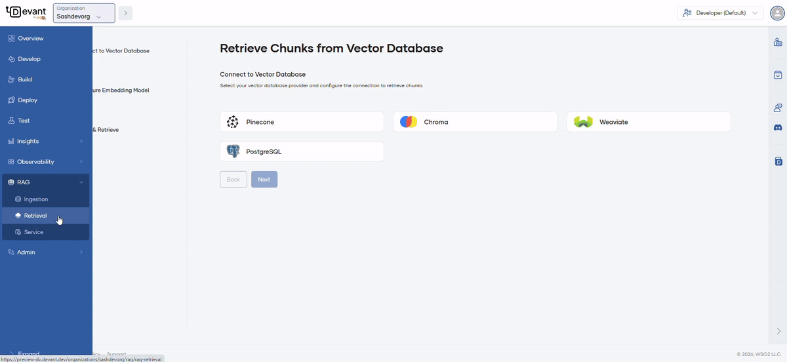

# RAG Retrieval

## Introduction
Retrieval-Augmented Generation (RAG) retrieval is the process of searching a vector database for the most relevant information in response to a user query.

!!! note 
    - This guide assumes you have already ingested files into your vector store. If you haven't already follow the [Ingestion](rag-ingestion.md) guide on how you can do that.

To retrieve chunks that have already been ingested (without uploading new files), navigate to your organization using the **Organization** dropdown in the top left of the Devant console header. In the left navigation menu, click **RAG**, then select **Retrieval**.

### Step 1: Initialize vector store

1. Select `Pinecone` as the vector database.
2. Enter the API key in the **API Key** field.

    ???+ info "Info"
        To create an API key, refer to the [Pinecone API key documentation](https://docs.pinecone.io/guides/projects/manage-api-keys#create-an-api-key).

3. Enter the **Collection Name**. The collection will be automatically created if it does not exist.
4. Click **Next**.

### Step 2: Configure the embedding model

1. Select `text-embedding-ada-002` embedding model from the **Open AI** dropdown.
2. Enter the API key in the **Embedding Model API Key** field.

    ???+ info "Info"
        To create an API key, refer to the [OpenAI platform documentation](https://platform.openai.com/docs/guides/embeddings).

3. Click **Next**.

### Step 3: Query and retrieve chunks

Execute queries to ensure proper data retrieval.

1. Enter a query according to the content of the files ingested previously.
2. **Maximum chunks to retrieve** and **Minimum similarity threshold** are automatically populated with default values. You can modify them if needed.

    ???+ info "Info"
        - **Maximum chunks to retrieve** defines the number of matching chunks to retrieve against the query.
        - **Minimum similarity threshold** determines whether a chunk is relevant enough to be considered a match for a given query. Expressed as a value between 0 and 1 (for example, 0.7 or 70% similarity).

3. Click **Retrieve**. The search results will display the chunks that match the query.

!!!info
     - Devant's retrieval process uses a reranking model to ensure that only the most accurate and contextually relevant chunks are returned.

After completing the RAG ingestion process, you can also implement a RAG retrieval to connect your vector database with user queries and generate responses using the WSO2 Integrator: BI.

For detailed implementation steps and configuration, refer to the [RAG retrieval](https://bi.docs.wso2.com/integration-guides/ai/rag/build-a-rag-application/#rag-retrieval) tutorial in the WSO2 Integrator: BI documentation.
