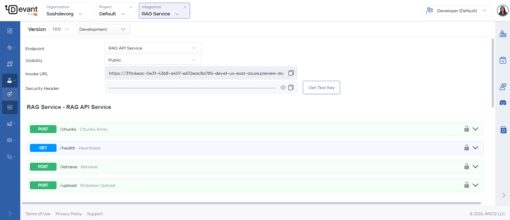

# RAG Service

## Introduction
Devant provides a set of RESTful API endpoints for Retrieval-Augmented Generation (RAG) workflows. These endpoints enable you to ingest, retrieve, and process documents programmatically.

### Step 1: Create service
Navigate to your organization using the **Organization** dropdown in the top left of the Devant console header. In the left navigation menu, click **RAG**, then select **Service**.

Fill in the required fields in the **Create RAG Ingestion Service** form to set up a new RAG service in Devant.

| **Field**        | **Value**         |
| ---------------- | ----------------- |
|**Project**       | Select the target project from dropdown which lists the available projects in your organization |
| **Display Name** | Sample RAG Service  |
| **Name**   | sample-rag-service  |
| **Description (Optional)**  | My rag service description |

Click the **Create Service** button and your service will get created 

!!! note
    - When the service is created, Devant automatically increases the container resources (CPU and memory) to ensure reliable operation.

### Step 2: Test endpoints
Once the component is created you will be redirected to the Overview page.

1. On the development environment card, click **Test** to open the OpenAPI Console, where you will be able to try out all the available endpoints from the endpoint list.
2. Expand the resource you want to test.
3. Click Try it out to enable it.
4. Provide values for the parameters.
5. Click **Execute**. The response will be displayed under the **Responses** section.
 
!!! note 
    - Some parameters are automatically populated with default values. You can modify them as needed.

    

### Available API endpoints
The image below shows how all the available endpoints are listed in the **Console** page. You can expand each endpoint and try them out as needed.

  

#### **POST `/upload`**

Upload a file and ingest it into your vector store. Supports PDF (including scanned PDFs), DOCX, PPTX, XLSX, CSV, HTML, MD, images, and audio (MP3, WAV, M4A, FLAC, OGG).

**Required in the request:**

- File to upload. 
- Vector DB provider (e.g., Pinecone, Chroma, Weaviate, Postgres) and connection/API key details.
- Collection name: where data will be stored.
- Embedding model provider and model (e.g., OpenAI, Azure, Mistral) and API key.
- Chunking strategy: `recursive`, `sentence`, or `character`.
- Max segment size and max overlap size for chunking.

**Expected response:**

Returns a JSON object indicating successful ingestion, including the file name and type. 

```json
{
    "message": "Added data to vector store successfully",
    "filename": "example.pdf",
    "file_type": "document"
}
```

---

#### **POST `/retrieve`**

Retrieve relevant chunks from your vector store based on a user query. Supports semantic search and optional reranking with Cohere.

**Required in the request:**

- Vector DB provider and connection/API key details.
- Name of the collection from which you want to retrieve chunks.
- Embedding model provider and model, and API key.
- User query for which you want to retrieve chunks.
- Max number of chunks to retrieve and minimum similarity threshold.

**Optional:**

- Cohere re-ranking model and API key (if using reranking) and the number of top results to rerank.

???+ info "Info" 
    - To create a Cohere API key, refer to the [Cohere documentation](https://dashboard.cohere.com/api-keys).

**Expected response:**

Returns a JSON object containing the user query and an array of retrieved chunks. Each chunk includes the content, the file it is from, and a timestamp.

```json
{
    "query": "What is Devant?",
    "retrieved_chunks": [
        {
            "text": "Devant is ...",
            "source": "example.pdf",
            "timestamp": "2026-02-16T12:02:25.076312"
        },
        ...
    ]
}
```

---

#### **POST `/chunks`**

Parse and chunk an uploaded file, returning the chunks as a JSON array. Does not store data in the vector DB.

This endpoint accepts all the same file types as the `/upload` endpoint, including PDF (with scanned PDF support), DOCX, PPTX, XLSX, CSV, HTML, MD, images, and audio files (MP3, WAV, M4A, FLAC, OGG).

**Required in the request:**

- File to upload.
- Chunk type: `recursive`, `sentence`, or `character`.
- Max chunk size and max overlap size.

**Expected response:**

Returns a JSON object containing the file name and an array of chunks. Each chunk includes a chunk ID and its content.

```json
{
    "filename": "example.pdf",
    "chunks": [
        { "chunk_id": 0, "content": "First chunk content..." },
        { "chunk_id": 1, "content": "Second chunk content..." }
    ]
}
```

---

#### **GET `/health`**

Health check endpoint. 

**Expected response:**

Returns a JSON object indicating the service status.

```json
{
    "status": "ok"
}
```

???+ info "Info"
    - For more details on RAG ingestion and retrieval, and how to obtain API keys and credentials refer the [RAG Ingestion](rag-ingestion.md) guide.
    
