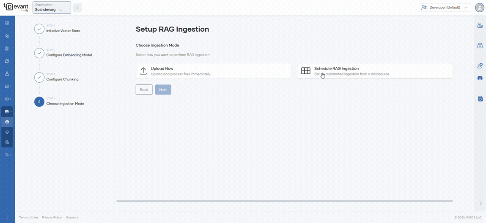
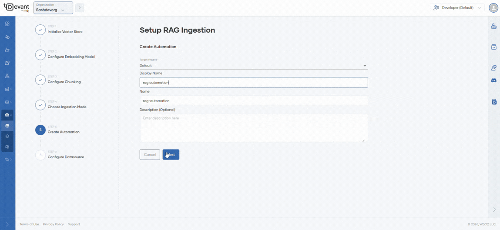
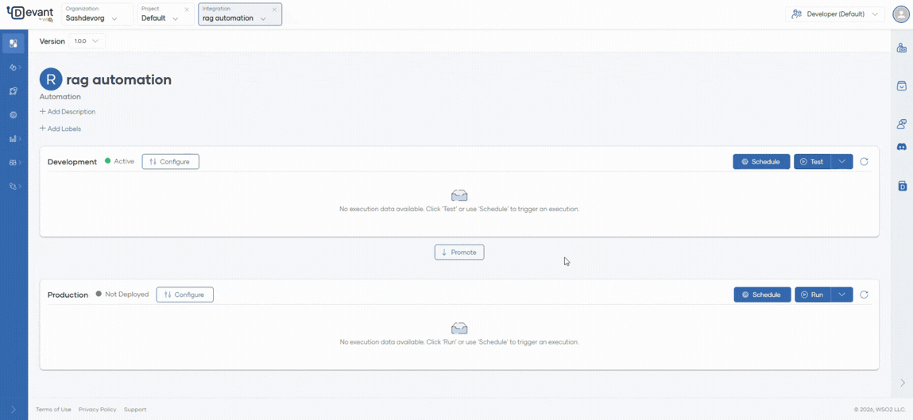
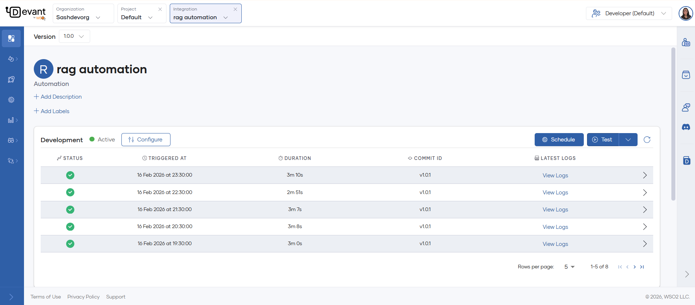

# Schedule RAG Automation

## Introduction

Devant provides a platform to automate document ingestion on a schedule and manage unstructured data for Retrieval-Augmented Generation (RAG) workflows.

This guide outlines the steps to set up scheduled RAG ingestion automation in Devant.

!!! note
    - Schedule RAG ingestion option is available only for paid Devant users.
    - This guide assumes you have completed steps 1 to 4 in the [RAG ingestion](rag-ingestion.md) guide.

After selecting **Schedule RAG Ingestion** as the ingestion mode, follow these steps:

### Step 1: Create automation
Fill in the required fields in the details form to create an automation in Devant for scheduled RAG ingestion.

| **Field**        | **Value**         |
| ---------------- | ----------------- |
|**Project**       | Select the target project from dropdown which lists the available projects in your organization |
| **Display Name** | Sample Automation   |
| **Name**   | sample-automation   |
| **Description (Optional)**  | My sample automation description |

### Step 2: Configure datasource 

The datasource specifies the location from which files will be ingested. Devant supports both Google Drive folders and Amazon S3 buckets as datasources.

1. Select `Google Drive` as the datasource.

2. Enter the **API Key** in the API key field.

    ???+ info "Info"
        For instructions on creating an API key, see the [Google documentation](https://docs.cloud.google.com/docs/authentication/api-keys#create). Ensure the key has the required [Drive API scopes](https://developers.google.com/workspace/drive/api/guides/api-specific-auth) enabled.

3. Provide the **Folder ID** of the Google Drive folder containing the files to be ingested.

    ???+ info "Info"
        The Google Drive folder ID can be found in the URL when viewing the folder in Google Drive. It is the string that appears after `/folders/` in the URL.

4. Click **Create Automation** to complete the setup. You will be redirected to the automation overview page.

    !!! note
        - When a scheduled RAG ingestion automation is created, Devant automatically increases the container resources (CPU and memory) for the automation to ensure reliable operation.
        
        - If you need to process very large files or expect high ingestion volumes, you can further scale your container resources  in **Containers** tab from the **Admin** dropdown at the bottom of the left navigation.

### Step 3: Schedule Ingestion

Once created, the automation is automatically deployed in the development environment with all previously entered configurations prefilled.

- To trigger an immediate ingestion, click the **Test** button.
- To schedule ingestion for a specific time interval, click the **Schedule** button and select your desired time.

You can verify successful ingestion by reviewing the automation logs.

As shown below, you can automate your ingestion workflow at specified intervals (e.g., minutely, hourly, daily, monthly). During each scheduled run, the system detects new files in the data source and ingests them into the vector store.

