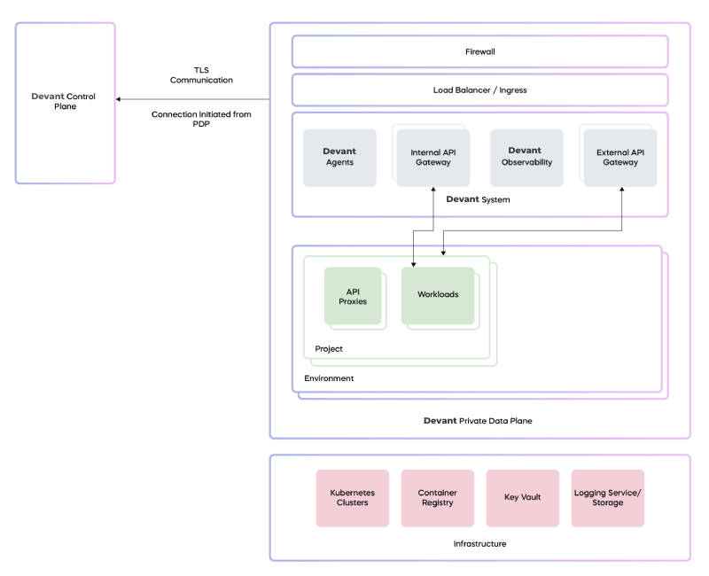

# Data Planes

Devant's architecture comprises two key components: the control plane and the data plane. The control plane handles essential tasks such as administering organizations, users, and projects. In addition, it also governs the entire journey of integration development, from the initial stages of creation, progressing to deployment, including measures to enforce governance and the provision for observability. The Devant control plane is a SaaS that manages all cloud data planes and private data planes. It caters to diverse user personas, including CIOs, architects, and developers, as well as DevOps, and platform engineers.

The data plane is the environment where user integrations are deployed based on configurations set in the control plane. The integrations can be built in [Ballerina](https://ballerina.io/) and [Wso2 Micro Integrator](https://wso2.com/integrator/micro-integrator/) which are optimized for building integrations or using the Devant Cloud Editor. Importantly, all traffic related to the runtime of user integrations are restricted to the Devant data plane, ensuring strict containment of user data within its boundaries.

Devant's architecture features two distinct data plane types: cloud data planes and private data planes. A cloud data plane utilizes a multi-tenanted infrastructure model for deploying user integrations, creating a shared yet secure environment for integration runtime. In contrast, a private data plane(PDP) provides dedicated infrastructure for a single organization to run its user integrations. This ensures an added layer of privacy and control for organizations with specific requirements.

## Private data planes

### Infrastructure

Devant private data planes can be deployed with almost all major cloud providers, such as Azure, AWS, and GCP, and are also compatible with on-premises infrastructure.

The essential requirements for a private data plane include upstream-compatible Kubernetes clusters, a container registry, a key vault (secret store), and a logging service or log storage.

### System components

Setting up the Devant PDP system involves using a Helm installation on the Kubernetes infrastructure. 
The following software components are installed during the helm execution:

  - Cilium CNI and service mesh.
  - Devant API Gateways and related components.
  - Devant PDP agent.
  - Observability and logging APIs, along with observability agents.
  - Flux controller.

All of these software components receive automatic updates, including security patches and bug fixes through the flux controller connected to the Devant Update Management System. 

### Connectivity with the control plane

The private data plane requires communication with the Devant control plane to manage various activities. All these communications are outbound from the private data plane, ensuring that there is no need to open any specific `IP:Port` from its perspective for these interactions. However, if an organization's network restricts all outbound traffic, it is necessary to permit outbound traffic to the public IP range of the Devant control plane.

The following table outlines the inbound and outbound connections from a private data plane:

<table border=1>
<thead>
<tr>
<th align="left">Data plane component</th>
<th align="left">Endpoint</th>
<th align="left">Direction</th>
<th align="left">Protocol</th>
</tr>
</thead>
<tbody>
<tr>
<td rowspan=2>Devant PDP agent</td>
<td>Devant control plane (CP) (mizzen server)</td>
<td>Outbound</td>
<td>WSS</td>
</tr>
<tr>
<td>Kubernetes API server</td>
<td>Outbound (cluster internal)</td>
<td>HTTPS, WS</td>
</tr>
<tr>
<td rowspan=2>APIM/local adaptor</td>
<td>Global adaptor</td>
<td>Outbound</td>
<td>HTTPS</td>
</tr>
<tr>
<td>Azure Service Bus (CP)</td>
<td>Outbound</td>
<td>AMQP</td>
</tr>
<tr>
<td >APIM/Enforcer</td>
<td>Event hub (CP)</td>
<td>Outbound</td>
<td>AMQP</td>
</tr>
<tr>
<td>Devant secret resolver</td>
<td>Cloud secret store</td>
<td>Outbound (VPC internal)</td>
<td>HTTPS</td>
</tr>
<tr>
<td rowspan=2>Container registry</td>
<td>Container registry (public)</td>
<td>Inbound</td>
<td>HTTPS</td>
</tr>
<tr>
<td>Container registry</td>
<td>Outbound (VPC internal)</td>
<td>HTTPS</td>
</tr>
<tr>
<td rowspan=2>Certificate manager</td>
<td>Azure DNS service</td>
<td>Outbound</td>
<td>HTTPS</td>
</tr>
<tr>
<td>LetsEncrypt</td>
<td>Outbound</td>
<td>HTTPS</td>
</tr>
<tr>
<td>Flux source controller</td>
<td>GitHub</td>
<td>Outbound</td>
<td>HTTPS</td>
</tr>
<tr>
<td>Flux Helm controller</td>
<td>Devant container registry</td>
<td>Outbound</td>
<td>HTTPS</td>
</tr>
</tbody>
</table> 

All communication between the control plane and the private data plane is secured using TLS.

### Observability architecture

The following diagram depicts the architecture overview of Devant's in-data-plane log and observability in Azure PDP:

[//]: # (Tooo: Modify this diagram to match Devant)
[//]: # (![Observability architecture]&#40;../assets/img/devant-concepts/observability-architecture.png&#41;)

The private data plane observability architecture is centered around a strong commitment to data privacy and compliance. This is achieved through a strategic decision to retain logs and observability data within the data planes itself. Key aspects of this architecture include:

- **Data storage at source**: Logs and observability data are stored within the data plane itself, enhancing security, simplifying access, and ensuring compliance.
- **Direct browser-to-data-plane interaction**: The Devant Console in the user's browser directly interacts with APIs in the data plane, reducing potential data routing complexities and ensuring a more secure, direct flow of information.
- **Reduced data exposure points**: Fetching data directly from the data plane's APIs minimizes the number of data transfer points, effectively decreasing the chances of data exposure or interception.
- **Compliance with regulatory standards**: The architecture supports data locality, aligning with global regulatory standards like GDPR and CCPA by keeping data in its original environment.
- **Improved performance and real-time insights**: Direct interaction between the browser and data plane results in faster data retrieval, providing users with immediate insights.
- **User transparency and control**: Users have a clear view of their data's location and access methods, alongside granular control over data access.

### Security

The Devant private data plane ensures extensive, production-grade security, ranging from infrastructure and architecture to zero-trust network security. All incoming traffic is protected by a firewall and must undergo authentication and authorization via the API Gateway. It also provides end-to-end network traffic encryption using Cilium transparent encryption, ensuring efficient data path encryption.

[//]: # (Uncomment the following line after adding the private data plane security levels)
[//]: # (For details on the private data plane security levels supported in Devant pricing plans, see [Private Data Plane Security Levels]&#40;../references/private-data-plane-security-levels.md&#41;.)

### Management models

Devant supports the following management models for private data planes (PDPs), fostering collaboration between WSO2 and customers across diverse scenarios:

  - WSO2 fully managed (infrastructure and PDP in WSO2 subscription) model
  - WSO2 fully managed (infrastructure and PDP in customer subscription) model
  - Customer self-managed (WSO2 provides installation script and updates) model

[//]: # (Uncomment the following line after adding the private data plane management models)
[//]: # (To explore each management model in detail so that you can make informed decisions depending on the supported cloud-based operations and security, see [Private Data Plane Management Models]&#40;../references/private-data-plane-management-models.md&#41;.)
