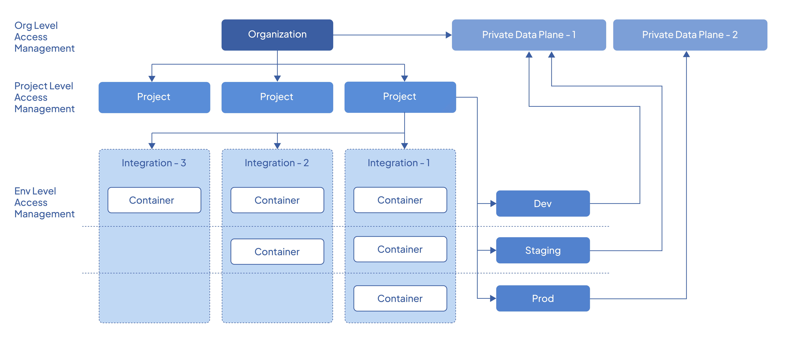

# Resource Hierarchy

The following diagram depicts the high-level resources and their relationships in Devant.

{.cInlineImage-full}

## Organizations and data planes

Data planes are connected to the organization and are available for all projects within the organization. When you create an environment in a project, the data plane connected to the organization is linked with an automatically generated Kubernetes namespace.

## Environments and data planes

Devant allows multiple Kubernetes clusters to be associated with an environment. This enables you to build highly resilient and resource-efficient solutions that utilize multiple clusters. Devant synchronizes your applications and workloads between associated clusters in an environment, allowing you to perform multi-cluster deployment with a single click.

The following diagram illustrates how multiple clusters associate with different environments:

{.cInlineImage-full}

!!! info "Note"
    It is not necessary to use a different cluster per environment. You can create multiple environments on the same cluster. The above diagram is an example of a specific solution. Your application architecture may require a different configuration than what is depicted.

## Components and environments

Components belong to a project in Devant, and environments are provisioned per project. When a component is deployed, it is deployed as a container to the specified environment. Once deployed, you can promote the container image across the environments available in the project.