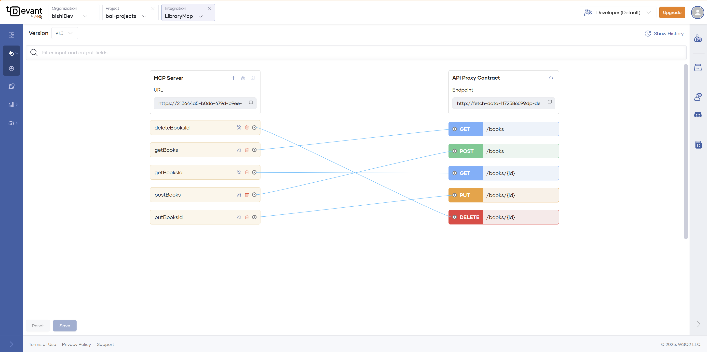

# Overview

## What is Model Context Protocol?

MCP is a JSON-RPC–based protocol designed to standardize how applications interact with large language models (LLMs). It enables sharing of contextual information—such as local files, databases, or APIs—with LLMs, while also allowing applications to expose tools and capabilities for AI-driven workflows and integrations.

MCP follows a host–client–server architecture and supports two primary transport mechanisms: stdio and streamable HTTP. While stdio is commonly used for local communication between clients and servers on the same machine, streamable HTTP is increasingly preferred for remote connections, especially as MCP adoption grows across networked environments. 

For more information, refer to the official [specification](https://modelcontextprotocol.io/introduction).

## Remote MCP Servers with Devant

Devant now includes support for MCP servers. It provides a complete solution for transforming existing APIs into intelligent, AI-ready tools. With a centralized control plane, Devant simplifies the entire lifecycle of MCP server management from creation to discovery, while delivering a seamless experience for both API developers and AI agent builders.  

In summary, Devant provides the following capabilities related to MCP.

1. Create MCP Servers from existing HTTP services.
2. Automatically generate the MCP tool schemas.
3. Secure the MCP Servers with OAuth2 security.

# Design and Publish MCP Servers

## Prerequisites

### Create an Organization

If you're signing in to the Devant Console for the first time, create an organization.

1. Go to [Devant Console](https://console.devant.dev/) and sign in using your Google, GitHub, or Microsoft account.
2. Enter a unique organization name.
3. Read and accept the privacy policy and terms of use.
4. Click **Create**.

This creates the organization and opens the organization home page.

### Create a Project

1. Go to [Devant Console](https://console.devant.dev/) and sign in. This opens the organization home page.
2. On the organization home page, click **+ Create Project**.
3. Enter the following details:

    !!! info
        The **Name** field must be unique and cannot be changed after creation.

    | **Field**        | **Value**         |
    | ---------------- | ----------------- |
    | **Display Name** | Sample Project    |
    | **Identifier**   | sample-project    |
    | **Description**  | My sample project |

4. Click **Create**. This creates the project and takes you to the project home page.

### Create MCP Servers for existing HTTP integrations

1. Navigate to an HTTP integration under the category `Integration as API` from Devant. At the top right corner, you will be able to see a button named `Generate MCP server`. 

2. Complete the form shown in the image below, then click `Create and Deploy`. This action will create and deploy the MCP server to the Development environment.

!!!important
    Although the MCP Server is associated with the HTTP service, their lifecycles are not tightly coupled. As a result, unpublishing or undeploying the HTTP service can disrupt the MCP Server created using it, so it’s important to manage these actions carefully.

!!!info
    The MCP Servers created in Devant currently support  **2025-03-16** specification.

## Modify Tools of your MCP Server

You can modify the details of the Tools of your generated MCP Server by clicking the `View More` button under the tool list. The default tool names and descriptions are generated by Devant based on the information available in the API contract.

The following options are supported when modifying the Tools

1. **Add new Tool** - You can create a new tool by selecting the **+** icon at the top. You have to provide the name and description at this stage. The schema will be auto generated once  you create the mapping to the REST resource
2. **Edit Tool details** - You can modify the tool name and description of each tool by clicking on the Tool icon. The tool schema cannot be modified.
3. **Delete Tools** - By default tools are created for all the resources of the REST service or the backend service. You can remove unwanted ones by deleting the tool.

!!!tip
    Clear and well-defined tool names and descriptions make it easier for LLMs to recognize and use the tools effectively. If the auto-generated versions don’t meet your needs, you should feel free to customize them to better suit your use case.

You have to **redeploy** the MCP Server after saving for the new changes to be reflected.

## Invoke the MCP Server

The MCP Inspector in Developer Portal allows you to list and invoke MCP tools. Follow these steps to publish and test your generated MCP server.

### Prerequisites
 Before you start, both the generated MCP server and the service used to generate it must be:
 - Deployed to Production
 - Published to the Dev Portal
 - Both services(the REST service used to create the MCP server and the generated MCP server) must be subscribed to the same application create in Dev Portal.

1. Publishing a REST Service to the Developer Portal
 Promote the REST service (used to generate the MCP server) to production. It will then be automatically published to the Developer Portal.
 - Go to the Overview page of the REST service and click the Developer Portal button located at the top right (second button).
 - You will be redirected to the Developer Portal’s representation of the service.
 - Click Subscribe and create an application.

💡 Note: Once the MCP server is also published to the Developer Portal, subscribe the same application to it as well.

2. Publish MCP Server to Developer Portal
 - Open your MCP server in the Devant.
 - Click Lifecycle Status in the top-right corner of the Overview page.
 - In the lifecycle graph, click Publish.
 - Go to the Overview page of the MCP service and click the Developer Portal button located at the top right (second button).
 - You will be redirected to the Developer Portal’s representation of the service.
 - Click Subscribe and create an application.
 - From the drop down list select the same application used by the REST service and subscribe.

3. Access MCP Inspector
 - Go back to the Devant MCP server Overview page.
 - In the Development environment header, click the Test icon.
 - This opens the MCP Inspector view in the Dev Portal.

4. Prepare the Access Token
 - Open the Applications view in another browser tab.
 - Select the application subscribed to both services.
 - Click Generate to create a token.
 - Copy the generated token.

5. Connect to MCP Server
 - Return to the MCP Inspector tab.
 - In the Token field, enter: Bearer <copied token>
 - Click Connect.

 

💡 Note: Clicking Connect sends an Initialize call to the MCP Server deployed in the gateway, establishing a connection.

6. Invoke MCP Tools
 Once connected, you can:
 - Select individual tools.
 - Provide parameters if required.
 - Execute the tool calls directly from the MCP Inspector UI.

!!!important
    If you are using another AI Agent or an MCP Client, you need to configure the MCP server urL and set the authorization token appropriately. You can retrieve the tokens as given in the 4th step under `Invoke the MCP` server section.
