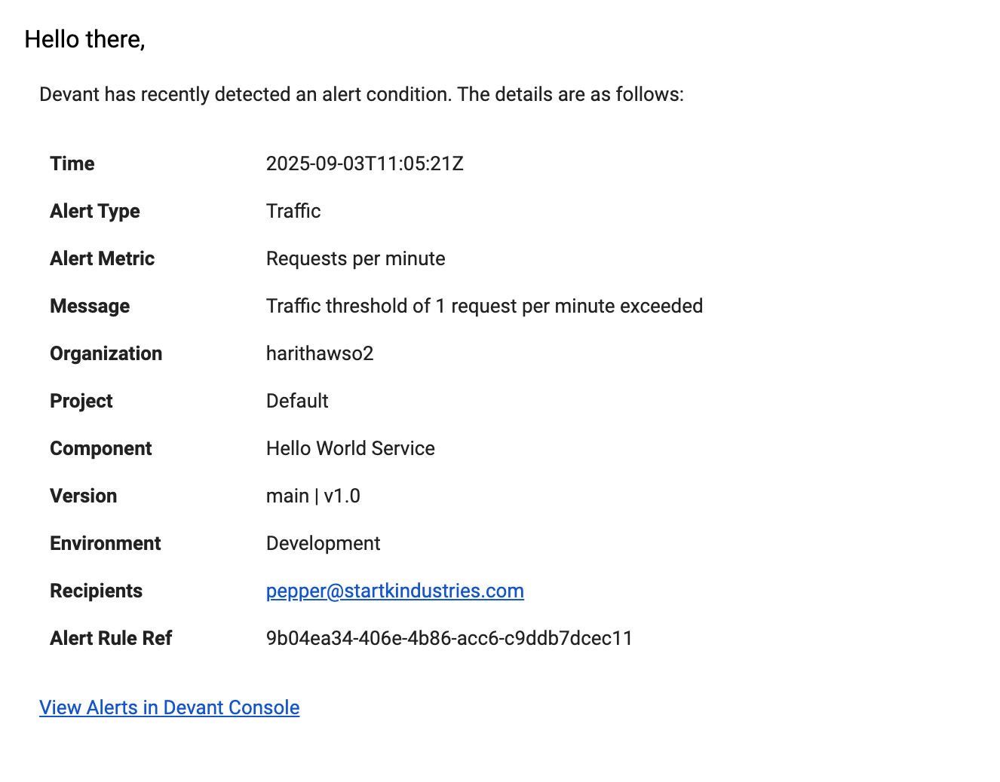

# Alerts Overview

This section explains how you can configure alerts for your Devant components. Setting up alerts allows you to proactively monitor your component ecosystem and take corrective measures when necessary.

!!! note
    Setting up alerts is only available at the component level.

## Alert types

Devant supports the following types of alerts to help you monitor and manage your components effectively:

- [Latency alerts](#latency-alerts)
- [Traffic alerts](#traffic-alerts)
- [Resource alerts](#resource-alerts)
- [Log alerts](#log-alerts)
- [Build failure alerts](#build-failure-alerts)

### Latency alerts

Latency alerts notify you when the response latency of a component exceeds a predefined threshold within a specified time period. This is useful for components that need to meet specific SLAs and proactively identify slow components.

Configurable parameters

| **Parameter** | **Description**                                                                 |
|---------------|---------------------------------------------------------------------------------|
| Metric        | 99th, 95th, 90th, or 50th percentile.                                           |
| Threshold     | Latency in milliseconds (e.g., 1800).                                           |
| Period        | Duration the threshold must be exceeded (e.g., 5 minutes).                      |

### Traffic alerts

Traffic alerts notify you when the request count of a component exceeds a predefined threshold. This is useful for managing components with backend traffic limits or monetized backends that require proactive scaling based on incoming traffic.

Configurable parameters

| **Parameter** | **Description**                                                                 |
|---------------|---------------------------------------------------------------------------------|
| Threshold     | Requests per minute (e.g., 200).                                                |
| Period        | Monitoring window (e.g., 5 minutes).                                            |

### Resource alerts

Resource alerts notify you when your component’s CPU or memory usage exceeds predefined thresholds. This ensures that you can adjust the resource allocations early to avoid performance issues or downtime.

Configurable parameters

| **Parameter** | **Description**                                                                 |
|---------------|---------------------------------------------------------------------------------|
| Metric        | CPU or Memory.                                                                  |
| Threshold     | **mCPU** for CPU and **MiB** for Memory (e.g., 1000).                            |
| Period        | Duration the threshold must be exceeded (e.g., 5 minutes).                      |

!!! tip
    - **CPU**: mCPU (milliCPU) measures CPU usage in fractions of a core, where 1000 mCPU = 1 full core.
    - **Memory**: MiB (Mebibyte) measures memory in binary units, where 1 MiB = 2^20^ bytes.

### Log alerts

Log alerts trigger notifications when a given phrase appears **a specific number of times** in your component logs within a defined time window. This helps to identify recurring issues or critical errors quickly, enabling faster troubleshooting.

Configurable parameters

| **Parameter** | **Description**                                                                 |
|---------------|---------------------------------------------------------------------------------|
| Search Phrase | Keyword or phrase that triggers the alert (e.g., failed).                       |
| Count         | Minimum number of occurrences to trigger the alert (e.g., 10).                  |
| Interval      | Time window for counting occurrences (e.g., 5 minutes).                         |

### Build failure alerts

Build failure alerts inform you when a build failure occurs for your component. This is essential for maintaining smooth development workflows.

## Configure an alert

Follow these steps to configure an alert:

1. Navigate to the component you wish to configure alerts for.

    !!! info
        You need to have a scope of **Devant DevOps** or **Devant Platform Engineer** in order to create alerts.

2. In the left navigation under **Observability**, click **Alerts**.
3. Click **Create Alert Rule** to create a new alert rule.
    
    {style="width:80%;"}

4. Select the **[Alert Type](#alert-types)** you want to create.
5. Select the **Environment** you want to create the alert for.
6. Select the **Deployment Track** or **Version** as required for the component.
7. Configure the remaining fields specific to your selected alert type.
8. In the **Emails** field, specify the email addresses that should be notified when the alert is triggered.

    !!! note
        - When adding an email, type the required address and press `Enter` to add it.
        - You can add a maximum of 5 email addresses per alert.

9. You can configure additional parameters in the **Advanced Configurations** dropdown as needed, which vary based on alert type.
10. The **Explanation** callout provides a summary of the configured alert based on the alert configurations.
11. Click **Create** to save and activate your alert rule.

    !!! info
        - You can configure a maximum of 10 alerts per component.

12. Once successfully added, your alert will be listed in the **Configure Alerts** pane alongside any existing alerts for the component.
13. Each alert can be **edited**, **removed**, and **disabled** or **enabled** via this pane.

    !!! note
        When editing an alert, **Alert Type**, **Environment**, and **Deployment Track** cannot be changed.

## Alert history & notifications

### View alert history

You can check the past alerts that have triggered for your component in the **Alerts History** pane. You can filter the alert history by **Alert Type**, **Environment**, **Deployment Track** or **Version**, and **Time Range**.

!!! note  
    When filtering, **API Proxy** components show a **Version** filter, and other components display a **Deployment Track** filter based on their monitoring context.

You can click on an alert to expand it to see more details about the alert.

### Email notifications

When an alert is triggered, recipients receive an email with details and a link to view the alert in Devant.

{style="width:80%;"}
