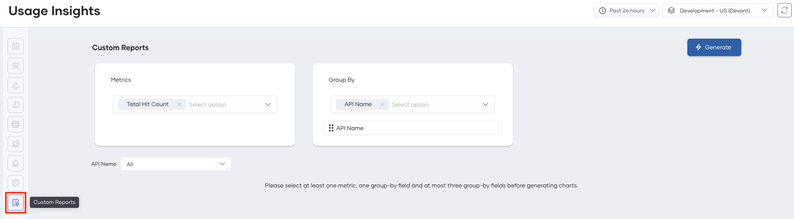

# Generate Custom Reports

Devant usage insights allow you to generate custom reports to view important information and make timely decisions for the betterment of your business. With custom reports, you can generate reports for a set of metrics of your choice and aggregate results by specific fields. Once generated, the metrics can be filtered out using any selected group-by filters. Custom reports can be visualized as overtime charts, pie charts, or tables.

## Metrics

Devant usage insights allow you to retrieve data for the following metrics:

 - Total Hit Count
 - Response Cache Hit Count
 - Request Mediation Latency
 - Response Mediation Latency
 - Backend Latency
 - Total Latency
 - API Error Count
 - Target Error Count

## Group-by

**Group-by** fields specify how to group the metric data. For example, You can select **Total Hit Count** in the **Metrics** field and **API Name** under **Group-by** to retrieve the total hit count grouped by API name.

Devant usage insights allow you to group metric data by the following fields:

 - API Name
 - API Version
 - API Resource Template
 - API Method
 - API Creator
 - Application
 - Application Owner
 - Destination
 - User Agent
 - Platform

To generate a custom report, follow the steps below:

1. Navigate to the **Usage Insights** page under **Insights**, **Usage** in the left navigation menu.

2. In the left sub-navigation menu of **Usage Insights**, click **Custom Reports**.

    {style="width:80%;"}

3. Select metric(s) from the **Metrics** drop-down selector.

    {style="width:80%;"}

4. Select between 1 and 3 group-by fields from the **Group By** drop-down selector.

5. Set the order of the group-by filters by drag and drop to determine the grouping order of the selected metric(s).

6. Once you determine the order of the group-by fields, you can set values for each group-by field from the respective dropdown.

    {style="width:80%;"}

7. Click **Generate**.

    {style="width:80%;"}

## Download Reports

Devant usage insights allow you to download report data for each chart as a **PDF** or a **CSV** file.

To do this, click the **Download** icon on the top right of the relevant chart and select the required file format.
    {style="width:80%;"}
