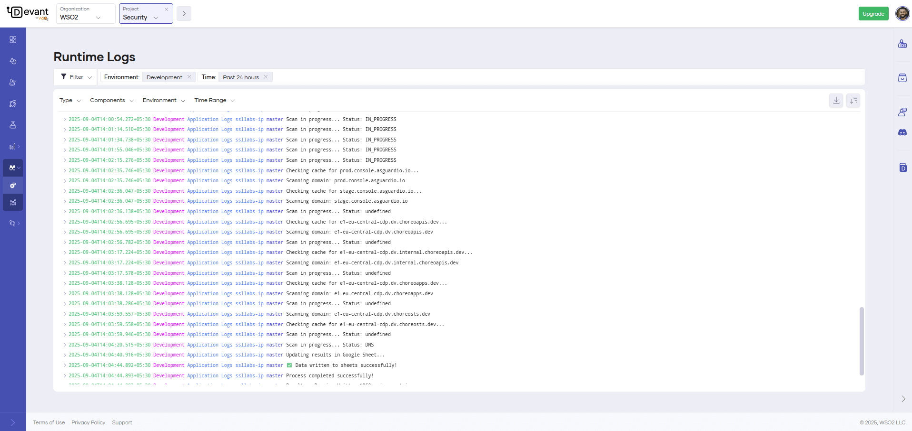
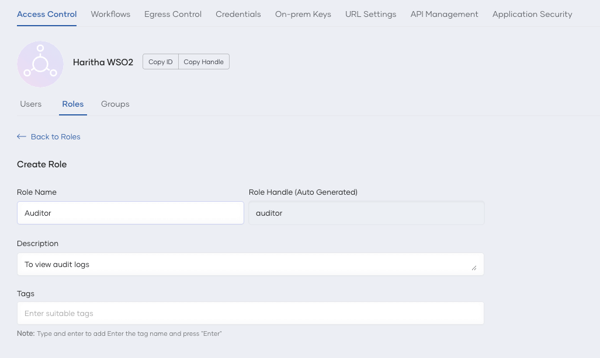
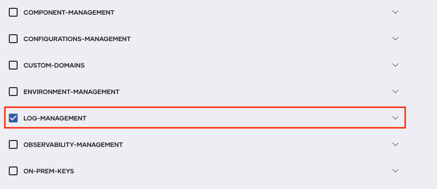
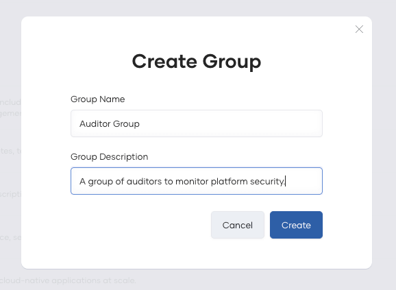
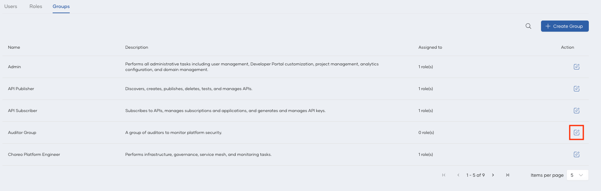

# Logs Overview

The unified log view in Devant allows you to view runtime and audit logs to gain insights into applications and users while preserving data privacy.

Devant provides real-time insights through live logs and allows you to view historical logs for insights into the past. You also have the flexibility to define a required time range to view relevant log entries, where an intuitive scrolling capability facilitates easy viewing of logs within the selected time frame.

The log view also provides advanced filtering capabilities that allow you to efficiently navigate through logs to expedite troubleshooting in distributed environments.

!!! note
    All personally identifiable information (PII) is resolved at the frontend service level, with only relevant UUIDs stored in logs.

## Runtime logs

Devant runtime logs provide insights into both project and integration-level logs, covering application and gateway logs. These logs streamline the debugging process by centralizing diverse log sources.

In Devant, any organization member can view runtime logs via the runtime logs page.

To access runtime logs, follow the steps below:

1. Sign in to [Devant](https://console.devant.dev/).
2. In the left navigation menu, click **Observability** and then click **Logs**. This displays runtime logs for the past 30 days by default.

    To view logs based on a specific time range and other requirements, you can apply the necessary filter criteria.

    

### Understand runtime logs

When you view integration-level logs on the **Runtime Logs** page, you will see both application and gateway logs.

#### Application logs

Each application log entry displays the following details:

  - `timestamp`: The time when the log entry was created.
  - `environment`: The environment in which the integration is running (e.g., Development).
  - `logType`: The type of log entry (e.g., Application, Gateway).
  - `version`: The version or deployment track of the integration.
  - `message`: The log message providing details about the event.

#### Gateway logs

Each gateway log entry displays the following details:

  - `timestamp`: The time when the request is received by the gateway component.
  - `logLine`: Contains the following details about the request, including inbound and outbound information from the gateway perspective.
    - `Method`: The HTTP method of the request.
    - `RequestPath`: The path of the inbound request.
    - `ServicePath`: The path of the outbound request.
    - `UserAgent`: The user-agent header of the request.
    - `CorrelationID`: The request identifier of the inbound request. This is useful to track a request.
    - `ServiceHost`: The host IP of the backend.
    - `Duration`: The time taken for the gateway to serve the request.  
  - `gatewayCode`: Indicates the state of the request from the gateway perspective. Possible values are as follows:
    - `BACKEND_RESPONSE`:  Indicates successful processing of the request by the gateway with a response to the client from the backend application.
    - `CORS_RESPONSE`: Denotes a CORS (Cross-Origin Resource Sharing) request.
    - `AUTH_FAILURE`: Indicates a request failure at the gateway due to authentication or authorization issues, such as an invalid token.
    - `NO_HEALTHY_BACKEND`: Indicates a request failure at the gateway due to a non-existent backend.
    - `RATE_LIMITED`: Indicates a request failure at the gateway due to surpassing the rate limit enforced within the integration.
    - `RESOURCE_NOT_FOUND`: Indicates a request failure at the gateway due to the absence of a matching API resource for the inbound request. This can be caused by a mismatch in the HTTP method, path, or host.
    - `BACKEND_TIMEOUT`: Indicates a request timeout when calling the backend application from the gateway.
    - `GATEWAY_ERROR`: Indicates a request failure due to an erroneous behavior in the gateway.
  - `statusCode`: The HTTP status code returned to the client.
  - `integrationVersion`: The version of the invoked integration.
  - `envName`: The environment of the inbound request. For example, Development, Production, etc.

### Filter runtime logs

Runtime logs can be filtered based on the following parameters:

- Type: Filter logs based on their type. Possible values are `Error`, `Warn`, `Info`, and `Debug`.
- Environment: Filter logs based on the environment in which the integration is running.
- Deployment Track: Filter logs based on the deployment track of the integration.
- Time Range: Filter logs based on a specific time range.
- Content Search: Filter logs based on specific keywords or phrases within the log messages.
- Regex Search: Filter logs using regular expressions to match specific patterns within the log messages.

You can type your search query in the search bar and press **Enter** to apply the content or regex search filter. 

!!! note
     Devant uses Lucene query syntax for regex search. For more information on Lucene syntax, see [Lucene Query Syntax Documentation](https://lucene.apache.org/core/2_9_4/queryparsersyntax.html).

## Audit logs

Audit logs, also called audit trails, enhance security, ensure compliance, provide operational insights, and help manage risks. 

In Devant, an audit log records organization-level user-specific operations performed via the Devant Console. It also captures the timestamp and the outcome of the action. 

As of now, Devant captures the following user-specific operations as audit logs:

- Project creation, update, and deletion.
- Integration creation, update, and deletion.
- Integration promotion initiation.
- Integration version creation.
- Integration deployment, redeployment, and undeployment initiation for all integrations.
- Integration as API access mode update.
- Enabling and disabling integration auto-deployment on commit. 
- Integration endpoint creation, update, and deletion.
- Organization user management.
- On-premises key management.
- Project-level configuration management.

In Devant, organization administrators are allowed to view audit logs by default. If other members need to access organization-specific audit logs, the administrator can create a role with the relevant permissions and assign it to members. For step-by-step instructions on how to create and assign a role with the relevant permissions, see [Manage audit log access](#manage-audit-log-access).

To view audit logs, follow these steps:

1. Sign in to [Devant](https://console.devant.dev/).
2. In the Devant Console, go to the top navigation menu and click **Organization**.
   
    !!! tip
         Currently, you can only view organization-level audit logs.

3. If you're using Devant as a Developer, click **Admin** and then click **Audit Logs**. If you're using Devant as a Platform Engineer, click **Observability** and then click **Audit Logs**.

    To view audit logs based on a specific time range and other requirements, you can apply the necessary filter criteria.

### Audit log retention

Devant retains audit logs for one year and archives them for an additional year. Therefore, the total retention period for audit logs is two years.

### Manage audit log access

Follow the steps given below to create a role with audit log access permissions and assign it to organization members who need access to audit logs.

!!! note
    You must be the organization administrator to perform this action.

#### Step 1: Create a role with audit log access permissions

1. In the Devant Console top navigation, click **Organization**.
2. In the left navigation menu, click **Admin** and then click **Settings**.
3. On the **Access Control** tab, click **Roles** and then click **+ Create Role**.
4. Enter a name and description for the role.
   
     

5. Under the **Permissions** list, select **LOG-MANAGEMENT**.

     

6. Click **Create**.  

#### Step 2: Create a group and assign the role and user to the group

1. On the **Access Control** tab, click **Groups**, and then click **+ Create Group**. 
2. Enter a name and description for the group, and then click **Create**.

     

3. On the **Groups** view, on the group you just created, click **Edit**.

     

4. Add the user to the group by clicking **+ Add Users**.
5. Assign the role you created in [Step 1](#step-1-create-a-role-with-audit-log-access-permissions) to the group.

     

    !!! tip
         If you want to invite one or more users and add them to the Auditor group, follow the steps given below:

           1. Navigate to the **Users** tab under **Access Control**.
           2. Click **+ Invite Users**.
           2. In the **Emails** field, enter the email addresses of users you want to invite.
           3. Click on **Groups** to expand the groups list. Select the group you created.
           4. Click **Invite**. This sends an invitation email to each email address so that the users can accept and obtain access to view audit logs.
