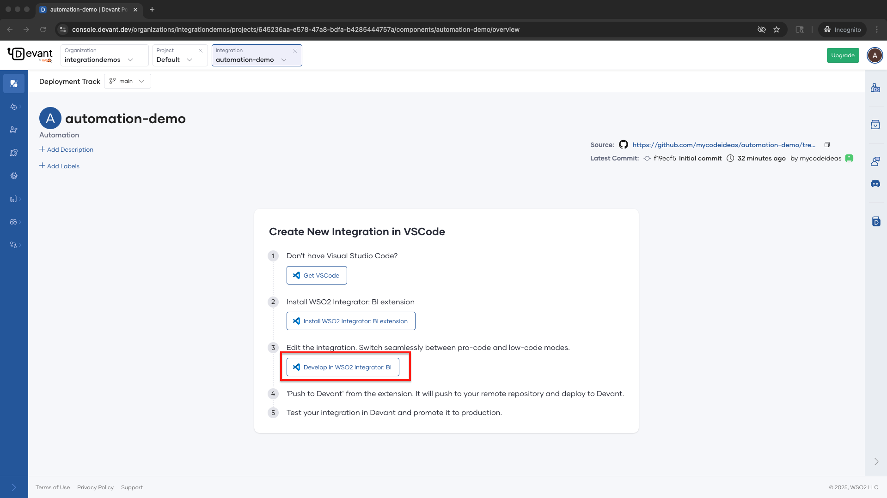

# Install and Set Up WSO2 Integrator: BI

[WSO2 Integrator: BI](https://wso2.com/integrator/bi/) is a low-code integration solution built on [Ballerina](https://ballerina.io/), enabling fast and efficient integration development with minimal coding. It enables you to build integrations easily from your local development environment. This guide walks you through the steps to install and set up BI using Visual Studio Code (VS Code).

## Step 1: Install the WSO2 Integrator: BI Extension

1. Once you start the integration creation in Devant by attaching a repository, you will be redirected to the **Create New Integration in VS Code** page.

    

2. If you don't have [Visual Studio Code](https://code.visualstudio.com/), click `Get VS Code` and install it. 

3. Then click **Install WSO2 Integrator: BI extension**. 

4. It will open the `WSO2 Integrator: BI` extension page and click **Install**. This will install both the `WSO2 Integrator: BI` and `Ballerina` extensions in VS Code.

    

## Step 2: Set up WSO2 Integrator: BI for the first time

1. Click the **BI** in the VS Code sidebar and click **Set up Ballerina distribution**. The setup wizard will automatically download and configure the required [Ballerina](https://ballerina.io/) distribution.

    

2. Once the setup is complete, click **Restart VS Code** to apply the changes.

    

## Step 3: Develop the integration in WSO2 Integrator: BI

1. Click **Develop in WSO2 Integrator: BI**. This will clone your integration project and open it in BI.
 
    

