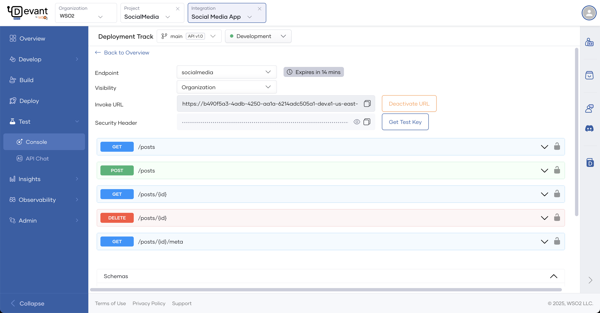
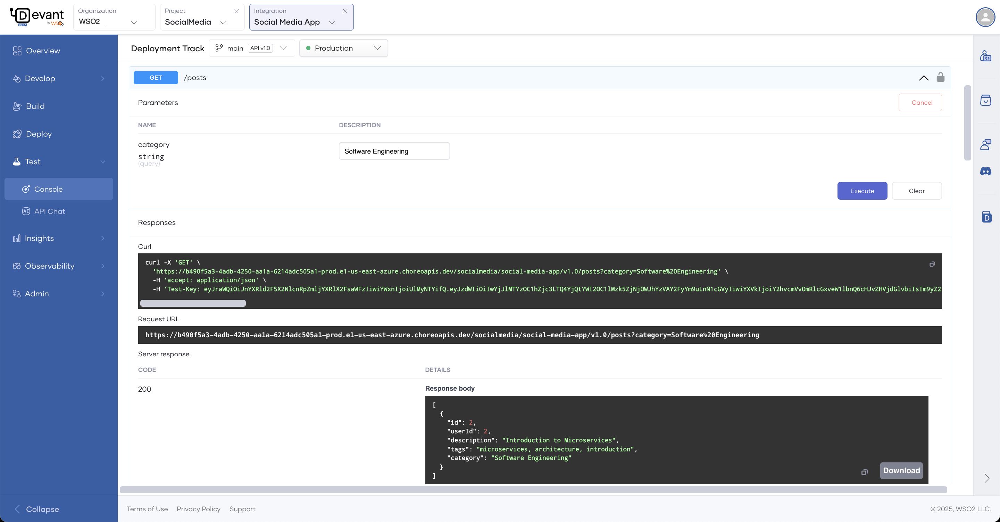

# Test REST Endpoints via the OpenAPI Console

Devant provides an integrated OpenAPI Console for testing REST endpoints of your deployed integrations. Since Devant secures REST APIs with OAuth 2.0 authentication, the console automatically generates test keys to facilitate API testing.

Follow these steps to test a REST endpoint using the OpenAPI Console:

1. Go to the [Devant Console](https://console.devant.dev/) and log in.
2. Select the project.
3. In the **Integrations** pane, click on the integration you want to test.
4. On the desired environment card, click **Test** to open the **OpenAPI Console**.
5. In the **OpenAPI Console** pane, choose the endpoint you want to test from the **Endpoint** list.

    !!! note
        - The **Network Visibility** of an endpoint is configured in the Configurations Drawer, which appears when you click `Configure` in a specific environment on the Integration Overview page. You can set the visibility to `Public`, `Organization`, or `Project`.
        - If the **Network Visibility** is set to `Public`, skip to step 7.
        - If the **Network Visibility** is set to `Organization`, the endpoint remains private. However, Devant lets you generate a temporary, publicly accessible test URL (secured with OAuth 2.0) for testing. This URL stays active for 15 minutes. To generate it, proceed to step 6.

6. If required, click **Generate URL** to create a temporary test URL. This URL will be valid for **15 minutes** and can be manually deactivated by clicking the **Deactivate URL** button.

    {.cInlineImage-full}

7. Expand the resource you want to test.
8. Click **Try it out** to enable testing.
9. Provide values for any parameters, if applicable.
10. Click **Execute**. The response will be displayed under the **Responses** section.

    {.cInlineImage-full}
